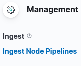
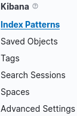
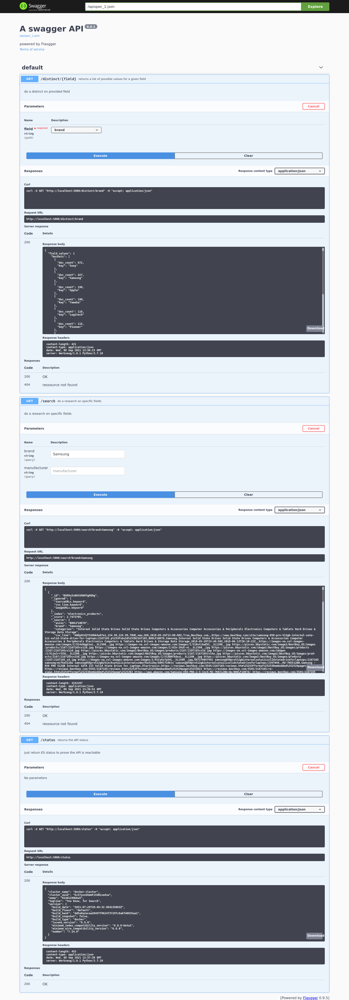

## **Purpose of this project and dataset description**
---
We want here to integrate a dataset into ElasticSearch and expose an API to access part of the data.

We choose a dataset from Amazon which is basically a list of over 7,000 electronic products with 10 fields of pricing information.

dataset link:
https://data.world/datafiniti/electronic-products-and-pricing-data<br>
field details:
https://developer.datafiniti.co/docs/product-data-schema

We will use flask to expose our API.<br>
Also Kibana will be helpul to explore data once integrated in ElasticSearch.


## **The files**
---

electronics_products.csv : the dataset<br>
api.py : the API<br>
ingest : basic script for integration in ElasticSearch<br>
electronics_products.conf : configuration file for ElasticSearch describing fields<br>

## **Integration into ElasticSearch**
---

You will need to start ElasticSearch. Unless you already have it running locally you can start it as a container this way


```python
docker pull docker.elastic.co/elasticsearch/elasticsearch:7.14.0
docker network create elastic
docker run --name es01-test --net elastic -p 9200:9200 -p 9300:9300 -e "discovery.type=single-node" docker.elastic.co/elasticsearch/elasticsearch:7.14.0
```

Also we will want Kibana to be running


```python
docker run --name kib01-test --net elastic -p 5601:5601 -e "ELASTICSEARCH_HOSTS=http://es01-test:9200" docker.elastic.co/kibana/kibana:7.14.0
```

given that you have curl and jq installed (apt get install otherwise) you can create an ElasticSearch ingest as below


```python
curl -X PUT localhost:9200/_ingest/pipeline/electronics_products -H "Content-Type: application/json" -d '{
    "processors": [
    {
      "csv" : {
        "field" : "csv_line",
        "target_fields": ["id","prices.amountMax","prices.amountMin","prices.availability","prices.condition","prices.currency","prices.dateSeen","prices.isSale","prices.merchant","prices.shipping","prices.sourceURLs","asins","brand","categories","dateAdded","dateUpdated","ean","imageURLs","keys","manufacturer","manufacturerNumber","name","primaryCategories","sourceURLs","upc","weight","Unnamed: 26","Unnamed: 27","Unnamed: 28","Unnamed: 29","Unnamed: 30"]
      }
    }
  ]
}' | jq
```

then we create the ES index (mapping and settings in electronics_products.conf)


```python
curl -X PUT "localhost:9200/electronics_products" -H "Content-Type: application/json" -d @electronics_products.conf | jq
```

we now want to integrate the csv file. Notice that we could integrate it in a friendly way from Kibana without creating an ingest (as our dataset is less than 100MB). We describe here the usual way in case we want to handle a bigger file in the future.<br>Feel free to have a coffee as this could be a  bit long


```python
cat ingest

#!/bin/bash
echo "processing $1.csv"
while read f1
do
   curl -s -X POST "localhost:9200/$1/_doc" -H "Content-Type: application/json" -d "{ \"csv_line\": \"$f1\" }" > ingest.log
done < $1.csv

ingest electronics_products
```

## **Checking in Kibana that everything is ok**
---

just go here


```python
http://localhost:5601/
```

check here that our ingest exists



Create here the index pattern to access data.
You  will need to enter the correct index name which is electronics_products.
Also you will be asked for a time field, the winner is "dateAdded" field.



you now can go in Analytics>Discover to check the data is here, update the time range is needed, modify the absolute StartDate eg. 2014 (upper right corner)


## **let's start our API**
---

just execute this


```python
python api.py
```

and if everything goes well the flask deamon is running here


```python
http://0.0.0.0:5000/
```

the api documentation stands here


```python
http://0.0.0.0:5000/apidocs/
```

below the API endpoints (3 ones). The point is here to prove that we can set up this architecture from end to end. Much more endpoint could be defined.


